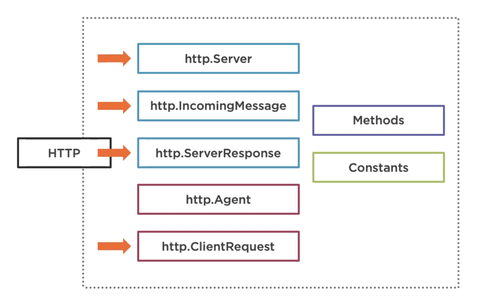
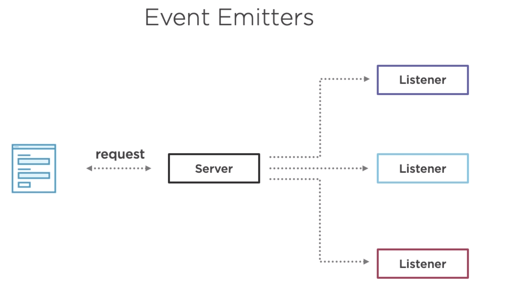
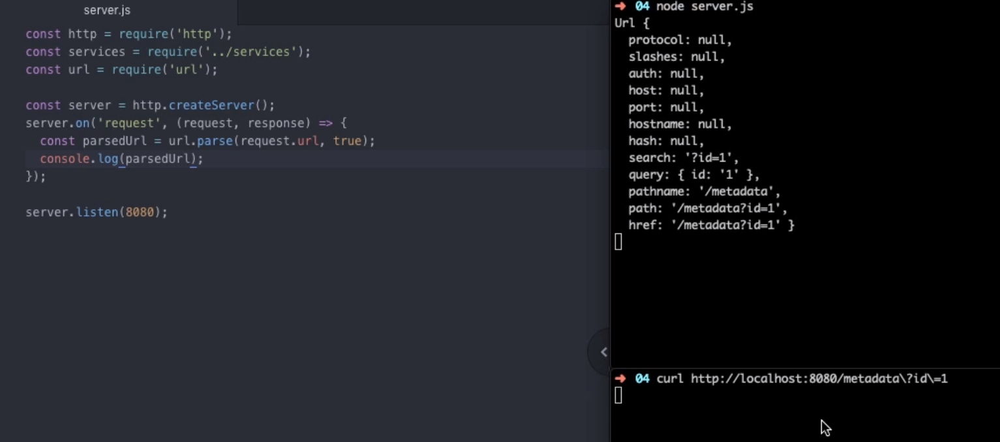
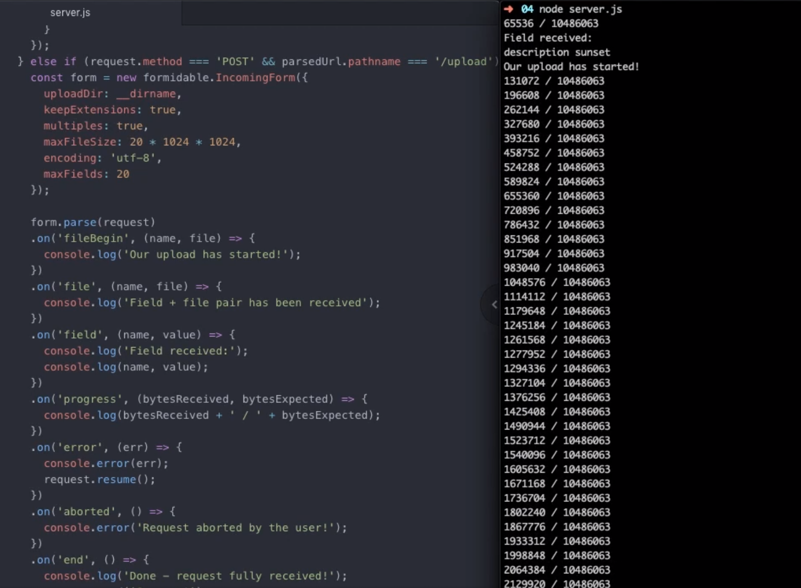

## Day 50 Monday 8 March 2021

[HTTP with Node.js](https://app.pluralsight.com/library/courses/http-with-nodejs/table-of-contents)

The image below makes up thge entire http module for Node



What are streams and event emitters? Take a look at the code below

```javascript
const server = http.createServer();

// register a handler for the servers 'request' event
server.on('request', (request, response) => {});
```

> Anytime the server emits an event with that name (request), our listener function is fired

Events can be emitted with parameters. Hypothetically, if we wanted to, we can register multiple handler functiosn for a single event, see below



In this case, everytime a requets came in, our server will emit the 'request' event and alll our listener functions will be triggered

### Streams

When working with node, whether you're reading a file from a file system or maing an API request, we'll often have access to data asynchronously or piece by piece



```javascript
...
request.on('data', (chunk)=>{
    console.log('This is a chunk \n');
    console.log(chunk.toString()); //convert the Buffer to string
    // somedata
    // This is a chunk
    //somemore dat
    // This is a chunk
    //a and here is more d
    //This is a chunk
    //ata
});
```

You need to collect all the data and piece it together, first create an empty array variable
`let body = []` netx, push each buffer into our array

```javascript
let body = [];
request.on('data', chunk => {
  body.push(chunk);
});

// add event listener when data is finished sending
request.on('end', () => {
  // no more incomming data

  //concat the individual Buffers into a single one then convert into a javascipt object with JSON.parse
  const parsedJSON = JSON.parse(Buffer.concat(body));
});
```

### Creating a Http response

4 things you need to do

1. Set the status code
2. Set headers
3. Write Data
4. Close connection

```javascript
response.statusCode = 404;
response.setHeader('X-Powered-By', 'Node');
response.end();
```

For working with file uplaoding in Node, checkout `formidable` js library used to work with file uploads



When working with http and node, better to use the `axios` package,
one method that might be helpful is the `axios.all([])` which accepts an array on axios requests and responds with an array promise

```javascript
axios
  .get([
    axios.get('http://www.google.com'),
    axios.get('http://www.twitter.com'),
  ])
  .then(resonseArray => {
    console.log(responseArray[0].data);
    console.log(responseArray[1].data);
  });
```

## Day 51 Tuesday 9 March 2021

[Linux Encryption Security](https://app.pluralsight.com/library/courses/linux-encryption-security-lpic-3-303/table-of-contents)

need to fill in some knowledge gap in my team, security is a vital skill as a DevOps engineer building and maintaining services.
https://bootstrap-it.com/encryption

Generat certificate signing request (CSR) with whcih you can get site certificates from trusted authorities

Not sure about this... don't really understand the course, will try again another time

## Day 52 & 53 10-11 March 2021

learning typescript
[Typescript Handbook](https://www.typescriptlang.org/assets/typescript-handbook.pdf)

learning the basics on Typescript, decided to work on a project as this is the best way to learn.

Programming language for the project is Typescipt, other tech used

- GraphQL
- APM and logging with Elasticsearch

The typecript handbook is good for javascript developers,not very long, still reading and will have to read a few times just to fully understand the main concepts

## Day 54 Friday 12 March 2021

Looking through the code base of the project i'm going to work on and there's a lot of javascript/typescript I need to understand so decided to read more js docs from Mozilla before continuing with the Typescript handbook

[Javascript Guide - Indexed Collections](https://developer.mozilla.org/en-US/docs/Web/JavaScript/Guide/Indexed_collections)

## Day 55 Saturday 13 March 2021

Reading more mozilla docs for javascript, focusing more on objects and classes. Understanding the prototype chain on javascript objects.

[Details of the Object model](https://developer.mozilla.org/en-US/docs/Web/JavaScript/Guide/Details_of_the_Object_Model)
